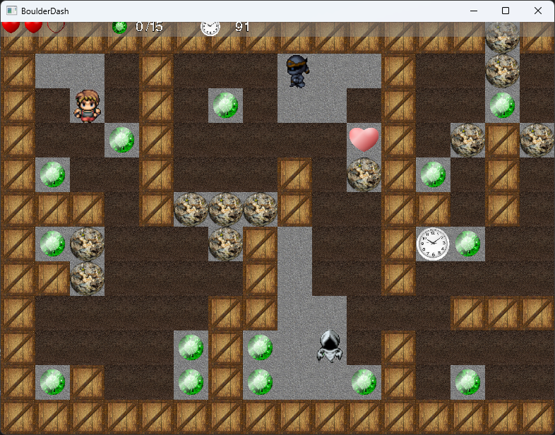

# Boulder Dash

A small 2D game inspired by Boulder Dash.

## About

This is an old pet project, originally written as an experiment in game development and OpenGL rendering.

It was never intended to become a finished product and was mainly used to explore low-level graphics, game loops, and basic engine structure.

## Features

- Tile-based level
- Player movement
- Collectible gems
- Rocks, walls, and obstacles
- Enemies and hazards
- Basic HUD (score, timer, lives)

## Tech

- C++
- OpenGL (fixed pipeline)
- FreeGLUT
- FreeImage

## Notes

The project reflects a very manual approach:

- custom game loop
- immediate mode rendering (glBegin / glEnd)
- simple texture and sprite handling
- no external engines or frameworks

## Status

Incomplete and abandoned.

Left here as an engineering artifact rather than a finished game.

## Screenshot

## Run

Open the Visual Studio project (.vcxproj) and build it.
